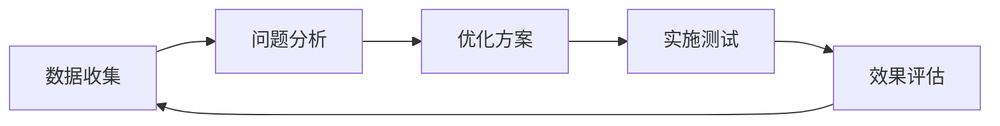

# SEO优化实施标准操作程序（SOP）

## 📋 概述

本文档定义了基于"精品工具页面2.0"模式的SEO优化实施标准流程，旨在提升网站在搜索引擎中的可见度和排名。

## 🎯 核心理念

**精品工具页面2.0 = 工具功能 + 落地页图文 + 结果展示列表**

将三个核心元素整合在同一页面，实现：
- 功能性：用户可以直接使用工具
- 可索引性：搜索引擎能充分理解页面内容
- 内容丰富性：展示结果增加页面价值

## 📐 架构设计

### 1. 页面结构层次

```
精品工具页面
├── Hero区域（SEO优化标题区）
│   ├── H1主标题（包含核心关键词）
│   ├── 描述文字（包含长尾关键词）
│   ├── 关键词标签云
│   └── 信任指标展示
├── 主体内容区（三合一设计）
│   ├── Tab 1: 工具功能区
│   │   ├── 输入表单
│   │   ├── 参数设置
│   │   └── 实时生成结果
│   ├── Tab 2: 结果展示区
│   │   ├── 精选作品
│   │   ├── 社区生成内容
│   │   └── 分页/加载更多
│   └── Tab 3: 指南内容区
│       ├── 功能特点
│       ├── 使用步骤
│       └── 常见问题FAQ
└── CTA区域（转化引导）
```

## 🚀 实施步骤

### 第一步：关键词研究与规划

1. **核心关键词确定**
   - 使用工具：Google Keyword Planner, Ahrefs, SEMrush
   - 选择标准：搜索量>1000/月，竞争度适中
   - 示例：`AI图像生成器`、`文本生成图片`

2. **长尾关键词挖掘**
   - 目标：每个页面10-15个长尾关键词
   - 示例：`免费AI图像生成器在线使用`、`FLUX图像生成替代品`

3. **关键词密度控制**
   - 主关键词：2-3%
   - 相关关键词：1-2%
   - 自然分布，避免堆砌

### 第二步：页面元数据优化

```typescript
// 标准元数据模板
export const metadata: Metadata = {
  title: "[主关键词] - [价值主张] | [品牌名]",  // 60字符以内
  description: "[包含关键词的描述，突出独特价值]",  // 155字符以内
  keywords: "关键词1, 关键词2, ...",  // 10个以内
  openGraph: {
    title: "[社交媒体标题]",
    description: "[社交媒体描述]",
    images: [{ url: "/og-image.png", width: 1200, height: 630 }]
  },
  alternates: {
    canonical: "https://domain.com/tool-page"
  },
  robots: {
    index: true,
    follow: true,
    googleBot: {
      index: true,
      follow: true,
      "max-snippet": -1,
      "max-image-preview": "large",
      "max-video-preview": -1
    }
  }
};
```

### 第三步：内容创建指南

#### 3.1 Hero区域内容

- **H1标题**：必须包含主关键词，吸引点击
- **副标题**：解释工具价值，包含2-3个相关关键词
- **关键词标签**：展示5-8个相关功能标签
- **信任元素**：用户数、生成数、安全认证等

#### 3.2 工具功能区

- **表单标签**：使用语义化HTML标签
- **占位符文本**：包含使用示例和关键词
- **按钮文案**：动作导向，如"立即生成"
- **结果展示**：实时反馈，增强用户体验

#### 3.3 落地页内容（重点）

必须包含的内容模块：

1. **功能特点介绍**（300-500字）
   - 每个特点50-80字描述
   - 包含技术关键词
   - 突出独特优势

2. **使用步骤说明**（200-300字）
   - 步骤化展示
   - 简洁明了
   - 包含操作关键词

3. **FAQ部分**（500-800字）
   - 至少6个常见问题
   - 回答包含关键词
   - 解决用户疑虑

4. **技术说明**（可选，200-300字）
   - AI模型介绍
   - 技术优势
   - 性能指标

#### 3.4 结果展示区

- **精选内容**：3-6个高质量示例
- **社区内容**：12-24个用户生成内容
- **元信息**：创建时间、浏览数、点赞数
- **标签系统**：风格、类型、模型等

### 第四步：技术优化

#### 4.1 性能优化

```javascript
// 图片懒加载
<Image
  src={imageUrl}
  alt={descriptiveAlt}  // SEO友好的alt文本
  loading="lazy"
  width={800}
  height={600}
/>

// 关键内容预加载
<link rel="preload" as="image" href="/hero-image.webp" />
```

#### 4.2 结构化数据

```json
{
  "@context": "https://schema.org",
  "@type": "WebApplication",
  "name": "AI图像生成器",
  "description": "专业的AI图像生成工具",
  "applicationCategory": "DesignApplication",
  "offers": {
    "@type": "Offer",
    "price": "0",
    "priceCurrency": "USD"
  },
  "aggregateRating": {
    "@type": "AggregateRating",
    "ratingValue": "4.8",
    "reviewCount": "1523"
  }
}
```

#### 4.3 内部链接策略

- 相关工具页面互链
- 面包屑导航
- 相关内容推荐
- 底部导航链接

### 第五步：内容更新策略

1. **定期更新频率**
   - 结果展示：每日更新
   - FAQ内容：每周更新
   - 功能说明：每月检查

2. **用户生成内容（UGC）**
   - 鼓励用户分享作品
   - 展示优质用户内容
   - 保持页面活跃度

3. **季节性内容**
   - 节日主题更新
   - 热点事件相关
   - 趋势性关键词

## 📊 监控与优化

### KPI指标

| 指标 | 目标值 | 监控频率 |
|------|--------|----------|
| 页面加载速度 | <2秒 | 每日 |
| 核心网页指标 | 全绿 | 每周 |
| 关键词排名 | Top 10 | 每周 |
| 自然流量增长 | +20%/月 | 每月 |
| 跳出率 | <40% | 每周 |
| 平均停留时间 | >3分钟 | 每周 |

### 监控工具

- **Google Search Console**：索引状态、搜索表现
- **Google Analytics 4**：用户行为、转化率
- **PageSpeed Insights**：性能监控
- **Ahrefs/SEMrush**：排名追踪、竞品分析

## 🔄 迭代优化流程

### 月度优化循环



### A/B测试项目

1. **标题测试**
   - 不同关键词组合
   - 情感诉求vs功能诉求
   - 长标题vs短标题

2. **CTA按钮测试**
   - 文案变化
   - 颜色对比
   - 位置调整

3. **内容布局测试**
   - Tab顺序
   - 内容密度
   - 视觉层次

## 📝 检查清单

### 发布前检查

- [ ] 元数据完整且优化
- [ ] H1-H6标签层次清晰
- [ ] 图片都有alt属性
- [ ] 内部链接正常
- [ ] 移动端适配完美
- [ ] 页面加载速度<2秒
- [ ] 结构化数据正确
- [ ] robots.txt允许爬取
- [ ] sitemap.xml已更新
- [ ] canonical URL设置

### 发布后监控

- [ ] Google Search Console无错误
- [ ] 页面正确被索引
- [ ] 关键词开始有展现
- [ ] 用户互动数据正常
- [ ] 无404错误
- [ ] 转化追踪正常

## 🎯 最佳实践总结

1. **内容为王**：高质量、原创、有价值的内容
2. **用户体验优先**：快速加载、易用性、移动友好
3. **技术规范**：遵循搜索引擎指南，避免黑帽SEO
4. **持续优化**：定期更新，响应算法变化
5. **数据驱动**：基于数据做决策，不断测试改进

## 📚 参考资源

- [Google搜索中心文档](https://developers.google.com/search)
- [Web.dev性能优化指南](https://web.dev/performance/)
- [Schema.org结构化数据](https://schema.org/)
- [Next.js SEO最佳实践](https://nextjs.org/learn/seo/introduction-to-seo)

---

*文档版本：1.0*  
*最后更新：2024-01*  
*下次审核：2024-02*