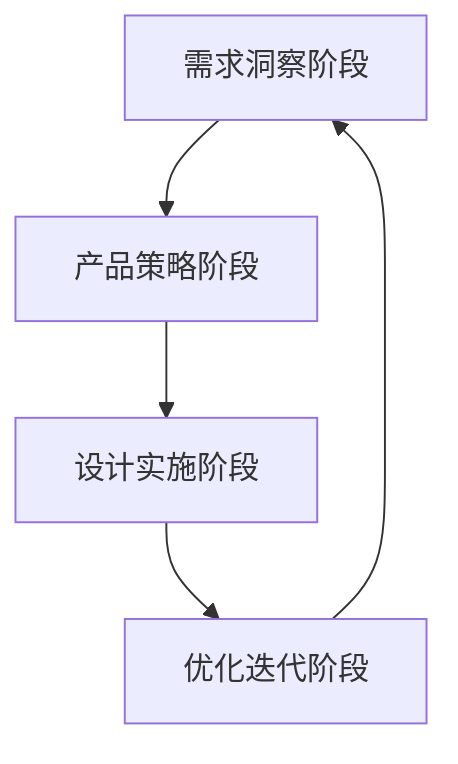

# SEO完整实施流程 - 增强版

## 📊 流程总览

基于你提出的6步框架，我建议扩展为**13步完整流程**，分为4个阶段：



## 第一阶段：需求洞察（1-3步）

### 1️⃣ 需求分析 ✅
**目标：理解用户搜索背后的真实意图**

#### 执行要点：
- **搜索意图分类**
  - 信息型：寻找知识（如何...）
  - 导航型：寻找特定网站
  - 交易型：准备购买/使用
  - 商业调研型：对比选择

- **需求挖掘方法**
  ```
  - Google搜索建议
  - People Also Ask
  - Related Searches
  - 社交媒体讨论
  - 客服常见问题
  ```

- **用户画像构建**
  - 技术水平（新手/专业）
  - 使用场景（个人/商业）
  - 价格敏感度
  - 时间紧迫度

#### 示例分析：
搜索："AI图像生成器"
- 意图：想要快速生成图片（交易型）
- 痛点：不会设计、没时间学PS
- 期望：简单、快速、效果好

### 2️⃣ 关键词研究 ✅
**目标：找到所有相关搜索词，构建关键词矩阵**

#### 关键词分层策略：
```
核心词（1-3个）
├── 品类词：AI图像生成器
├── 品牌词：[你的品牌] AI工具
└── 竞品词：Midjourney替代品

长尾词（20-50个）
├── 功能型：免费AI图像生成器在线
├── 场景型：AI生成商业海报工具
├── 问题型：如何用AI生成图片
└── 对比型：FLUX vs Midjourney

超长尾词（100+）
├── 具体需求：AI生成动漫风格头像免费
├── 组合需求：中文AI图像生成器无需注册
└── 地域需求：日本最好的AI图像生成工具
```

#### 工具推荐：
- Ahrefs Keywords Explorer
- SEMrush Keyword Magic Tool
- Google Keyword Planner
- Answer The Public

### 3️⃣ 竞品分析 ✅
**目标：学习成功经验，找到超越机会**

#### 分析维度：
| 维度 | 分析内容 | 工具 |
|------|---------|------|
| 流量来源 | 哪些关键词带来流量 | SimilarWeb |
| 内容策略 | 页面结构、内容深度 | 手动分析 |
| 技术实现 | 加载速度、移动适配 | PageSpeed Insights |
| 转化路径 | CTA设计、转化漏斗 | Hotjar |
| 外链策略 | 高质量外链来源 | Ahrefs |

#### 竞品分析模板：
```markdown
竞品名称：___________
月流量：___________
主要关键词TOP10：
1. _________ (搜索量：___, 排名：___)
2. ...

优势：
- 
- 

劣势：
- 
- 

可借鉴点：
- 
- 
```

## 第二阶段：产品策略（4-6步）

### 4️⃣ 产品内核 ✅
**目标：明确差异化优势，建立竞争壁垒**

#### 差异化策略矩阵：
```
技术差异化
├── 独家模型（如自研算法）
├── 性能优势（更快、更稳定）
└── 功能创新（独特功能）

体验差异化
├── 界面设计（更简洁易用）
├── 工作流程（更高效）
└── 本地化（语言、文化）

商业差异化
├── 价格策略（更便宜/性价比）
├── 服务模式（订阅/买断）
└── 生态系统（插件、API）
```

### 5️⃣ 商业模式验证 🆕
**目标：确保SEO流量能转化为商业价值**

#### 验证清单：
- [ ] 目标用户付费意愿调研
- [ ] 竞品定价策略分析
- [ ] 免费/付费功能边界设计
- [ ] 获客成本(CAC)预估
- [ ] 用户生命周期价值(LTV)计算
- [ ] ROI预期设定

### 6️⃣ 技术可行性评估 🆕
**目标：确保技术能力支撑产品承诺**

#### 评估维度：
- **性能要求**：并发用户数、响应时间
- **成本控制**：服务器、API调用成本
- **扩展性**：架构是否支持快速扩展
- **稳定性**：故障恢复、数据备份
- **安全性**：用户数据保护、支付安全

## 第三阶段：设计实施（7-10步）

### 7️⃣ 功能设计 ✅
**目标：基于需求设计核心功能**

#### 功能优先级矩阵：
```
        高价值
          ↑
    P0核心功能 | P1重要功能
    必须有      | 应该有
    ------------|------------
    P3可选功能  | P2补充功能
    锦上添花     | 差异化
          ↓
        低实现难度 → 高实现难度
```

### 8️⃣ 内容策略规划 🆕
**目标：创建搜索引擎和用户都喜欢的内容**

#### 内容矩阵：
| 内容类型 | 目的 | 更新频率 | 字数要求 |
|---------|------|----------|----------|
| 工具说明 | 功能介绍 | 月度 | 500-800 |
| 使用教程 | 用户教育 | 周度 | 800-1200 |
| 案例展示 | 社会证明 | 日度 | 200-300 |
| 行业资讯 | 流量获取 | 日度 | 600-1000 |
| FAQ | 解答疑问 | 周度 | 1500-2000 |

#### 内容生产流程：
```
关键词研究 → 内容规划 → 创作/采集 → 
SEO优化 → 发布 → 效果监测 → 迭代优化
```

### 9️⃣ 用户体验路径设计 🆕
**目标：优化从搜索到转化的完整路径**

#### 关键路径设计：
```
搜索结果页（标题+描述吸引点击）
    ↓
着陆页头部（3秒内传达核心价值）
    ↓
功能展示（降低使用门槛）
    ↓
信任建立（案例、评价、认证）
    ↓
行动引导（清晰的CTA）
    ↓
转化完成（注册/付费）
    ↓
持续激活（引导深度使用）
```

#### 优化指标：
- 跳出率 < 40%
- 平均停留时间 > 3分钟
- 页面深度 > 2页
- 转化率 > 2%

### 🔟 UI设计 ✅
**目标：将功能和内容以最优方式呈现**

#### SEO友好的UI设计原则：
- **信息架构清晰**：H1-H6标签层次分明
- **视觉层次突出**：重要内容优先展示
- **加载速度优先**：首屏2秒内加载
- **移动端适配**：响应式设计
- **交互简单直观**：减少用户思考

## 第四阶段：优化迭代（11-13步）

### 1️⃣1️⃣ SEO技术优化 🆕
**目标：确保搜索引擎正确理解和收录**

#### 技术检查清单：
```yaml
基础优化:
  - Title标签优化（50-60字符）
  - Meta Description（150-160字符）
  - URL结构优化（简洁、包含关键词）
  - Canonical标签设置
  - Robots.txt配置
  - XML Sitemap生成

性能优化:
  - Core Web Vitals达标
  - 图片压缩和懒加载
  - CSS/JS压缩合并
  - CDN部署
  - Gzip压缩

结构化数据:
  - Schema.org标记
  - Open Graph标签
  - Twitter Cards
  - JSON-LD实施

内链优化:
  - 面包屑导航
  - 相关推荐
  - 标签系统
  - 站内搜索
```

### 1️⃣2️⃣ 数据监控体系 🆕
**目标：建立数据驱动的优化机制**

#### 核心监控指标：
| 指标类型 | 具体指标 | 工具 | 监控频率 |
|---------|---------|------|----------|
| SEO表现 | 关键词排名 | Ahrefs | 周度 |
| | 索引数量 | GSC | 日度 |
| | 自然流量 | GA4 | 日度 |
| 用户行为 | 跳出率 | GA4 | 日度 |
| | 停留时间 | GA4 | 日度 |
| | 转化率 | GA4 | 日度 |
| 技术健康 | 页面速度 | PSI | 周度 |
| | 404错误 | GSC | 日度 |
| | 移动适配 | GSC | 周度 |

### 1️⃣3️⃣ 持续优化迭代 🆕
**目标：基于数据持续改进**

#### PDCA优化循环：
```
Plan（计划）
├── 分析数据发现问题
├── 制定优化假设
└── 设计A/B测试方案

Do（执行）
├── 实施优化方案
├── 控制变量
└── 收集数据

Check（检查）
├── 分析测试结果
├── 验证假设
└── 总结经验

Act（行动）
├── 推广成功经验
├── 修正失败方案
└── 进入下一循环
```

## 📋 实施时间表建议

| 阶段 | 时间 | 关键产出 |
|------|------|----------|
| 需求洞察 | 第1-2周 | 需求文档、关键词列表、竞品报告 |
| 产品策略 | 第3周 | 产品定位、商业模式、技术方案 |
| 设计实施 | 第4-8周 | 功能开发、内容创建、UI设计 |
| 优化迭代 | 第9周起 | 持续优化、数据报告、迭代计划 |

## 🎯 成功标准

### 短期目标（3个月）
- [ ] 核心关键词进入前20名
- [ ] 自然流量月增长20%
- [ ] 跳出率降低到50%以下

### 中期目标（6个月）
- [ ] 核心关键词进入前10名
- [ ] 自然流量占比达到40%
- [ ] 转化率达到2%

### 长期目标（12个月）
- [ ] 核心关键词进入前3名
- [ ] 品牌词搜索量增长10倍
- [ ] SEO带来的收入占比30%

## 💡 核心要点总结

1. **需求为王**：深入理解用户搜索意图是一切的基础
2. **内容致胜**：高质量、持续更新的内容是SEO的核心
3. **体验优先**：用户体验信号越来越影响排名
4. **数据驱动**：没有数据支撑的优化都是盲目的
5. **持续迭代**：SEO是马拉松，不是短跑

---

*这个增强版流程在你的6步基础上，补充了商业验证、内容策略、技术优化、数据监控等关键环节，形成了更完整的SEO实施体系。*